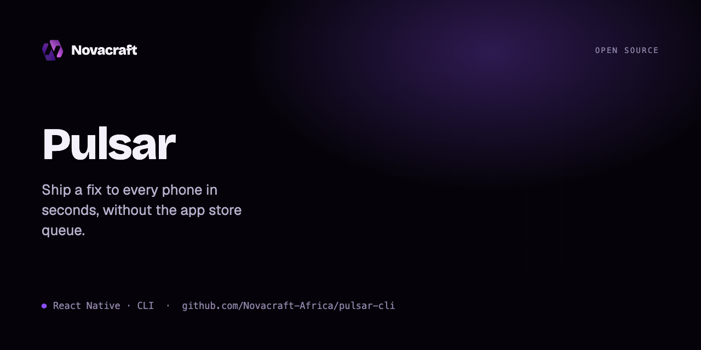

# @novacraft-engineering/pulsar-cli

Release CLI for [Pulsar](https://pulsar.novacraft.africa) — bundle your React Native JavaScript, hash it exactly the way the client does, and ship it over-the-air.

## Install

```bash
npm i -g @novacraft-engineering/pulsar-cli
# or run without installing:
npx @novacraft-engineering/pulsar-cli login https://api.pulsar.novacraft.africa
```

## Commands

```bash
pulsar login <apiUrl>                 # authenticate, saved to ~/.pulsar/config.json
pulsar apps                           # list your apps and deployment keys

pulsar release <app> <deployment> --platform ios|android --target <ver> \
       [--rollout 25] [--mandatory] [--description "fix crash"]

pulsar promote <app> <from> <to> [--rollout 100]
pulsar rollback <app> <deployment>

pulsar deployment ls <app>            # list deployments + keys
pulsar deployment add <app> <name>    # create a new deployment (e.g. QA)
pulsar history <app> <deployment>     # release history
pulsar patch <app> <deployment> <label> [--rollout N] [--mandatory] [--disable] [--enable]
```

## How a release works

`release` runs the React Native bundler, computes the **CodePush package hash** (the exact
`path:sha256` manifest algorithm the on-device client uses — so a device that already has the
bundle correctly reports "up to date"), zips the output, and uploads it to Pulsar. The client
then downloads it in the background and swaps it in on next launch.

Auth is read from `PULSAR_API_URL` / `PULSAR_TOKEN` env, or `~/.pulsar/config.json` (written by `pulsar login`). Nothing is committed.

## License

MIT © Novacraft Engineering
